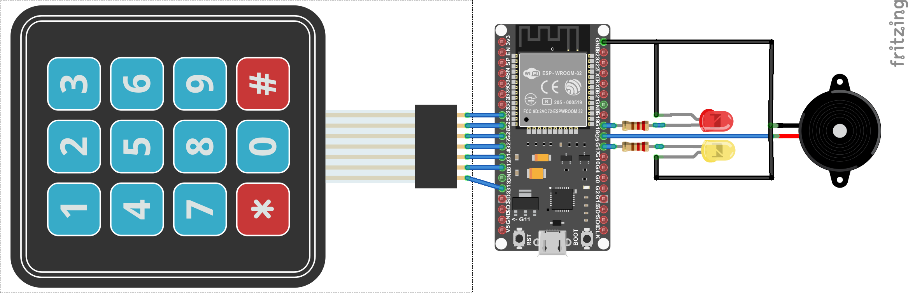

# Home Security System  - Main unit

## Pin Assignment:

| ESP32  | Device       |
| ------ | ------------ |
| GPIO18 | Buzzer       |
| GPIO19 | Alarm LED R  |
| GPIO5  | Alert LED Y  |
| GPIO12 | Keypad col 0 |
| GPIO13 | Keypad col 1 |
| GPIO14 | Keypad col 2 |
| GPIO27 | Keypad row 0 |
| GPIO26 | Keypad row 1 |
| GPIO25 | Keypad row 2 |
| GPIO33 | Keypad row 3 |

## API 

This designs several APIs to fetch resources as follows:

| API                   | Method | Resource Example | Description |
| --------------------- | ------ | ---------------- | ------------|
| `/ble/scan`           | `GET`  | resp: { [ { address: "11:22:33:44:55:66"  name: "device" } ] } | Scan nearby BLE devices |
| `/ble/device/add`     | `POST` | {  address: "11:22:33:44:55:66"  } | Add selected device to recognized devices |
| `/ble/device/remove`  | `POST` | {  address: "11:22:33:44:55:66"  } | Remove selected device from recognized devices |
| `/ble/device/list`    | `GET`  | resp: { list: [ {address: "11:22:33:44:55:66"} ] distance: 4.5 } | Return all recognized devices |
| `/ble/device/rssi`    | `POST` | {  distance: 4.5  } | Change max detection distance |
| `/code/change`        | `POST` | {  code: "123456"  new_code: "1234"  } | Change alarm deactivation code |
| `/system/arm`         | `GET`  | {} | Activate system |
| `/status`             | `GET`  | resp: { status: "Armed" alarm: 1589742868  sensors: 1 notResponding: 0 } | System status |
| `/sensors/list`       | `GET`  | resp: { list : [ { address: "11:22:33:44:55:66"  type: 0 last_alarm: 1589742868 last_connection: 1589742868 } ] unknown: { address: "11:22:33:44:55:77" type: 1 } } | Return all sensors and one new sensor if connected |
| `/sensors/remove`     | `POST` | {  address: "11:22:33:44:55:66"  } | Remove sensor |
| `/sensors/add`        | `POST` | {  address: "11:22:33:44:55:66"  } | Add new sensor |
